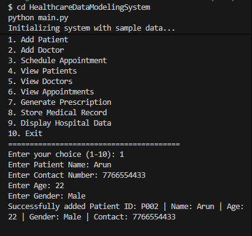

# 🏥 Healthcare Data Modeling System

## 📌 Project Title
Healthcare Data Modeling System using Python (OOP)

---

## 📖 Problem Statement
Healthcare systems manage large volumes of data such as patient records, doctor details, appointments, prescriptions, and medical history. Traditional manual systems are inefficient, error-prone, and difficult to scale.  
This project aims to develop a structured and modular healthcare data management system using Object-Oriented Programming (OOP) concepts in Python.

---

## 🎯 Objectives
- To design a healthcare management system using OOP principles
- To manage patient, doctor, and appointment data efficiently
- To demonstrate encapsulation, inheritance, abstraction, and polymorphism
- To provide a simple CLI-based interface for interaction

---

## 🛠️ Tools & Technologies Used
- **Programming Language:** Python 3
- **Concepts Used:** OOP (Encapsulation, Inheritance, Abstraction, Polymorphism)
- **IDE:** VS Code / PyCharm
- **Version Control:** Git & GitHub

---

## 📁 Project Structure
HealthcareDataModelingSystem/
│
├── main.py
├── patient.py
├── doctor.py
├── appointment.py
├── prescription.py
├── medical_record.py
├── hospital.py
├── utils.py
├── requirements.txt
│
├── screenshots/
│ └── patient.png
│
└── README.md
## Output Screenshots

### Add Patient

## 📌 Future Enhancements

- Add GUI interface
- Store data using database
- Add authentication system

